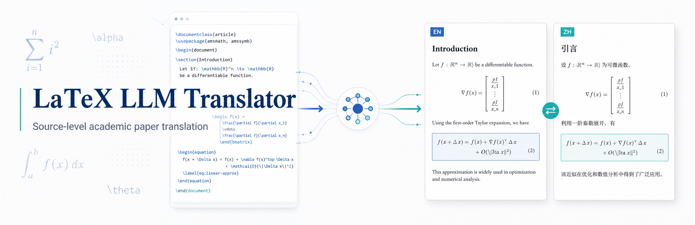

<p align="center">
  
</p>

# LaTeX LLM Translator

A web application for translating English LaTeX paper projects into Chinese at the source-code level.

The app takes a complete LaTeX project zip, compiles the original PDF, extracts translatable LaTeX blocks, lets you review an automatically generated glossary, translates the source with an OpenAI-compatible LLM, rebuilds a Chinese LaTeX project, and provides PDF previews and downloads.

## Features

- Upload complete LaTeX projects as `.zip` files.
- Detect the main `.tex` file and compile the original English PDF.
- Parse LaTeX source into translatable blocks while protecting formulas, citations, references, labels, URLs, graphics, and structural commands.
- Extract a domain glossary with an OpenAI-compatible LLM and edit it before translation.
- Translate block by block with retry support, progress tracking, and manual block editing.
- Generate a translated LaTeX project without modifying the original source.
- Compile the translated Chinese PDF with XeLaTeX and `ctex`.
- Preview and download original, translated, and generated side-by-side comparison PDFs.
- Manage LLM settings from the web UI, including model, base URL, API key, timeout, and concurrency.
- Run with Docker Compose using FastAPI, Vue 3, SQLite, Redis, and TeX Live.

## Workflow

1. Log in with the configured account.
2. Create a task and upload a LaTeX project zip.
3. Wait for the original PDF compilation.
4. Extract and review the glossary.
5. Start translation.
6. Review translation blocks and edit translations if needed.
7. Compile the translated PDF.
8. Generate or download the side-by-side comparison PDF.

## Tech Stack

Backend:

- Python 3.12 in Docker
- FastAPI
- SQLAlchemy
- SQLite
- httpx
- latexmk / XeLaTeX / TeX Live

Frontend:

- Vue 3
- Vite
- Element Plus
- lucide-vue-next
- Browser-native PDF iframe preview

Runtime:

- Docker Compose
- Redis container for deployment parity and future worker expansion
- Local `workspace/` and `data/` volumes for task files and SQLite data

## Repository Layout

```text
.
├── backend/
│   ├── app/
│   │   ├── api/          # FastAPI routes
│   │   ├── core/         # settings
│   │   ├── db/           # SQLAlchemy session setup
│   │   ├── models/       # database models
│   │   ├── services/     # LaTeX, LLM, glossary, compile, PDF services
│   │   └── workers/      # background task runner and task orchestration
│   ├── Dockerfile
│   └── requirements.txt
├── frontend/
│   ├── src/
│   │   ├── api/
│   │   ├── components/
│   │   ├── router/
│   │   └── views/
│   ├── Dockerfile
│   └── package.json
├── data/                 # SQLite database, ignored by git
├── workspace/            # uploaded and generated task files, ignored by git
├── docker-compose.yml
└── .env.example
```

## Quick Start With Docker

Requirements:

- Docker
- Docker Compose

Start the app:

```bash
cp .env.example .env
docker compose up --build
```

Open:

- Frontend: <http://localhost:3000>
- Backend health check: <http://localhost:18000/api/health>

Default login:

```text
username: admin
password: admin
```

For a real deployment, change `APP_PASSWORD` or set `APP_PASSWORD_HASH`, and replace `JWT_SECRET_KEY` with a long random value.

## Local Development

Docker is recommended because the backend image includes the TeX Live packages needed to compile common academic templates.

If you run locally without Docker, install Python dependencies, Node dependencies, and a TeX Live distribution that includes XeLaTeX, `latexmk`, `ctex`, `texlive-publishers`, `texlive-fonts-recommended`, and `texlive-science`.

Backend:

```bash
cd backend
pip install -r requirements.txt
uvicorn app.main:app --reload --host 0.0.0.0 --port 8000
```

Frontend:

```bash
cd frontend
npm install
npm run dev
```

When running the frontend dev server, configure `CORS_ORIGINS` to include `http://localhost:5173`.

## Configuration

Environment variables are loaded from `.env` by Docker Compose.

| Variable | Default | Description |
| --- | --- | --- |
| `APP_USERNAME` | `admin` | Single login username. |
| `APP_PASSWORD` | `admin` | Plain password used when `APP_PASSWORD_HASH` is empty. |
| `APP_PASSWORD_HASH` | empty | Optional bcrypt hash. Prefer this for deployments. |
| `JWT_SECRET_KEY` | `change-me-in-production` | Secret used to sign JWT tokens. |
| `SESSION_EXPIRE_HOURS` | `24` | Login token lifetime. |
| `DATABASE_URL` | `sqlite:////app/data/app.db` in Docker | SQLAlchemy database URL. |
| `WORKSPACE_DIR` | `/app/workspace/tasks` in Docker | Root directory for task files. |
| `CORS_ORIGINS` | localhost origins | Comma-separated allowed frontend origins. |

LLM configuration is managed in the web UI. The backend calls OpenAI-compatible chat completion APIs at:

```text
{base_url}/v1/chat/completions
```

Example model settings:

```text
base_url: https://api.openai.com
model: gpt-4o-mini
```

```text
base_url: http://127.0.0.1:11434
model: qwen2.5:14b
api_key: ollama
```

## API Overview

All task, file, glossary, block, and LLM configuration APIs require authentication.

Auth:

- `POST /api/auth/login`
- `POST /api/auth/logout`
- `GET /api/auth/me`

LLM configuration:

- `GET /api/llm-configs`
- `POST /api/llm-configs`
- `PUT /api/llm-configs/{config_id}`
- `DELETE /api/llm-configs/{config_id}`
- `POST /api/llm-configs/{config_id}/test`

Tasks:

- `GET /api/tasks`
- `POST /api/tasks`
- `GET /api/tasks/{task_id}`
- `DELETE /api/tasks/{task_id}`
- `POST /api/tasks/{task_id}/upload`
- `POST /api/tasks/{task_id}/compile-original`
- `POST /api/tasks/{task_id}/extract-glossary`
- `POST /api/tasks/{task_id}/start-translation`
- `POST /api/tasks/{task_id}/compile-translated`
- `POST /api/tasks/{task_id}/generate-comparison-pdf`

Task resources:

- `GET /api/tasks/{task_id}/glossary`
- `GET /api/tasks/{task_id}/blocks`
- `GET /api/tasks/{task_id}/logs`
- `GET /api/tasks/{task_id}/pdf/original`
- `GET /api/tasks/{task_id}/pdf/translated`
- `GET /api/tasks/{task_id}/pdf/comparison`
- `GET /api/tasks/{task_id}/download/translated-project`

## Data and Generated Files

Each task stores files under:

```text
workspace/tasks/{task_id}/
├── upload/
├── source/
├── translated/
├── build_original/
├── build_translated/
├── build_comparison/
├── output/
└── logs/
```

Important outputs:

- `output/original.pdf`
- `output/translated.pdf`
- `output/comparison.pdf`
- `output/translated_project.zip`

`workspace/` and `data/` are ignored by git.

## LaTeX Translation Strategy

The translator works on LaTeX source, not rendered PDFs.

It extracts natural-language blocks such as titles, abstracts, section headings, captions, and paragraphs. Before sending a block to the LLM, it protects LaTeX structures with placeholders and validates that placeholders survive the translation.

The generated Chinese project is written to `translated/`. The original source under `source/` is not overwritten.

By default, `.bib` files are copied but not translated.

## Known Limitations

- LLM output quality depends on the configured model and glossary.
- Complex custom LaTeX macros may require parser improvements.
- Table body translation is conservative; captions are the primary supported table text.
- Browser-native PDF viewers do not expose reliable scroll control to JavaScript, so the app uses generated comparison PDFs for stable side-by-side viewing.
- Uploaded LaTeX projects are compiled inside the backend container with fixed `latexmk` arguments, but this is still intended for trusted or controlled deployments.

## Troubleshooting

Health check:

```bash
curl --noproxy '*' http://127.0.0.1:18000/api/health
```

Service status:

```bash
docker compose ps
docker compose logs --tail=120 backend
```

If local `curl` requests to `127.0.0.1` return proxy-related errors, use `--noproxy '*'`.

If PDF compilation fails, check the task logs in the web UI or under:

```text
workspace/tasks/{task_id}/logs/
```

## Development Notes

- Keep translation block parsing conservative. Preserving LaTeX validity is more important than translating every possible token.
- Do not send an entire paper to the LLM in one request; translate by block.
- Do not write translated files back into `source/`.
- Do not translate `.bib` files unless this becomes an explicit optional feature.
- Prefer adding focused tests or real-task validation when changing parsing, generation, or compile behavior.

## License

This project is licensed under the Apache-2.0 License. See the [LICENSE](LICENSE) file for details.